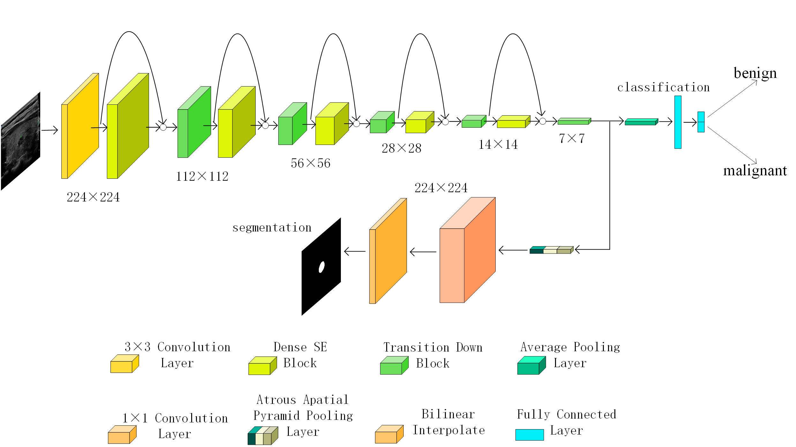

# DSMA-Net

This repository is DSMA-Net's attempt to classify breast tumors as benign or malignant on a publicly available breast dataset.

The dataset contains 630 ultrasound images. We randomly divided the dataset into training set, validation set and test set containing 504, 63 and 63 images respectively.

# Breast Dataset
Dataset: Al-Dhabyani W, Gomaa M, Khaled H, et al. Dataset of breast ultrasound images[J]. Data in brief, 2020, 28: 104863.

# DSMA-Net Architecture

  

The architecture of our proposed DSMA-Net. It contains a shared encoder backbone for feature extraction and two independent decoders for classification and segmentation.

  
  

Dense SE Blocks and ASPP Structures in DSMA-Net architecture.

## Prerequisites
- Python 3.6+
- PyTorch 1.0+

## Usage
### 1
Download the  dataset [here](https://drive.google.com/file/d/11peQ9NXuPA-QNNA9pmzD8SbTXTfQz17_/view?usp=drive_link) and put it into `./data`.
### 2
Use `python train.py` for training and then `python test.py` for testing.
### 3
If you want to compare, use `python train_compare.py` for training and then `python test_compare.py` for testing.
